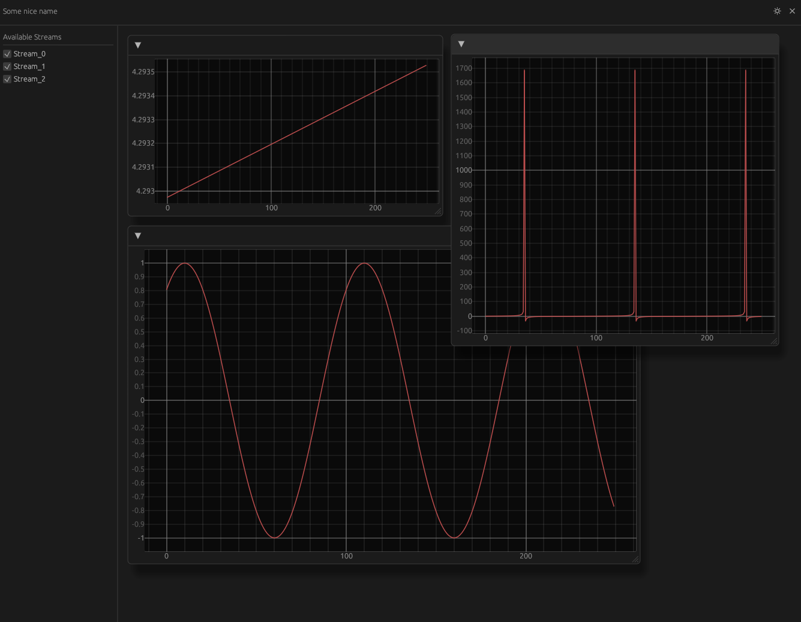

<!-- panvimdoc-ignore-start -->

<!-- panvimdoc-ignore-end -->

# purotto-rs

A data visualizer for piped inputs. Provides a real-time data visualization using the egui framework. 
Designed to plot multiple data streams simultaneously.

And of course, written in Rust.

This is mainly designed to work with serial outputs of micro-controllers. Check usage.

## Screenshot

## 🎮 Usage

- micro-controller should print to serial output in following format,
    {data_stream} {data_stream} {data_stream} ...
                 ^ _space seperated_
- Any and all strings in serial output are parsed _out_, and only integers are collected
- data streams should be values, NOT strings. 
- `cat /dev/tty_your_device_here | cargo run`: pipe in your data streams.

## 🎭 Contributing

Feel free to create an issue/PR if you want to see anything else implemented.
If you have some question or need help with configuration, start a [discussion](https://github.com/AZarbade/purotto/discussions).

## 📜 License

[MIT License](https://github.com/AZarbade/purotto/blob/main/LICENSE)
